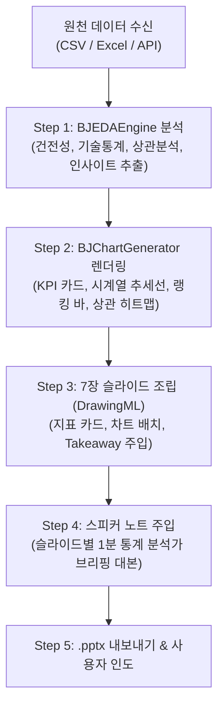

# Workflow: EDA to Presentation Deck (eda-to-deck)

> **목적**: 원천 데이터(CSV, Excel, API JSON 등)를 입력받아, 자동화된 탐색적 데이터 분석(EDA)을 수행하고 고해상도 시그니처 차트와 통계 인사이트를 포함한 7장 임원 보고용 PPTX를 자동 생성합니다.

---

## 1. 실행 트리거 (Triggers)
사용자가 다음과 같은 의도를 보일 때 본 워크플로우를 실행합니다:
- "이 csv 파일로 EDA 분석하고 슬라이드 만들어줘"
- "엑셀 데이터 분석해서 발표용 PPT로 구성해줘"
- "매출 데이터 분석 결과와 차트를 담은 경영진 보고서 만들어줘"
- "bjjang_eda 템플릿으로 데이터 분석 덱 뽑아줘"

---

## 2. 처리 단계 (Execution Pipeline)



---

## 3. 세부 실행 절차

### Step 1: 자동 EDA 및 통계량 추출
```bash
python scripts/eda_engine.py <data_file_path> [target_column]
```
- 데이터 규모(행/열), 결측치율(Missing rate), 중복값 검사
- 수치형 변수(평균, 중위수, 분산, 왜도, 사분위수) 및 범주형 빈도 연산
- 변수 간 상관계수 매트릭스 계산 및 타깃 변수를 가장 강하게 견인하는 **핵심 동인(Key Drivers)** 규명
- 슬라이드별 핵심 결론(Takeaway) 및 발표자 스피커 노트 자동 작성

### Step 2: 비제이짱 시그니처 차트 렌더링
```bash
python scripts/eda_charts.py
```
- `koreanize-matplotlib`를 사용하여 한글 폰트 깨짐 방지
- 비제이짱 시그니처 블루(`#1E40AF`, `#2563EB`) 및 고대비 팔레트 적용
- 4종 핵심 차트(KPI 카드, 추세선, 범주 랭킹, 상관 히트맵) 고해상도 PNG(200 DPI)로 렌더링

### Step 3: 네이티브 PPTX 프레젠테이션 빌드
```bash
python scripts/eda_to_deck.py <data_file_path> [--output <output_path>]
```
- 16:9 와이드스크린 (1920x1080 비율) 슬라이드에 모든 개체(도형, 텍스트, 차트 이미지) 배치
- 모든 텍스트 상자 및 카드는 PowerPoint에서 직접 클릭하여 수정 가능한 네이티브 DrawingML 형식 유지
- 슬라이드 하단 메모란에 통계 분석가 발표 대본 100% 자동 주입

---

## 4. 최종 결과물 점검 기준 (QA Checklist)
- [ ] 7장 슬라이드가 모두 정상 생성되었는가?
- [ ] 데이터 수치가 원천 데이터의 통계값과 일치하는가?
- [ ] 4개 차트 이미지가 찌그러짐 없이 선명하게 배치되었는가?
- [ ] 슬라이드마다 1줄 핵심 요약(Takeaway)이 명시되어 있는가?
- [ ] 슬라이드 하단 메모란에 발표자 스피커 노트가 빠짐없이 기록되었는가?
