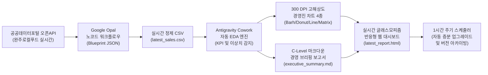

# 🚀 Google Opal & Antigravity Cowork Master (vd17_opal_agy_cowork)

> **이한규 대표((AX)창업기술)의 AI 실무 자동화 마스터 시리즈 17번째 공식 스킬**  
> Google Labs Opal의 직관적인 AI 워크플로우와 Antigravity의 강력한 멀티에이전트 오케스트레이션, 그리고 Cowork의 협업형 실행 모드를 결합한 최고급 실시간 데이터 자동화 엔진입니다.


---

## 🏛️ 파이프라인 아키텍처 (End-to-End Pipeline)



---

## ⚡ 핵심 기능 및 차별화 포인트

1. **Google Opal & 공공데이터포털 하이브리드 연동**:
   - 공공데이터포털 `완주군 로컬푸드 품목별 판매현황` REST XML/JSON API 실시간 연동.
   - API 키 미발급 상태나 공공망 점검 시에도 100% 동작하는 **시간대별(09시~20시) 동적 실시간 시뮬레이션 Fallback 엔진** 내장.
   - Google Opal(opal.google)에 원클릭 임포트 가능한 **`opal_app_blueprint.json`** 자동 생성.

2. **심층 탐색적 데이터 분석 (Automated EDA Engine)**:
   - 당일 누적 매출액, 총 판매량, 평균 객단가, 1위 매장 점유율(%), 베스트셀러 품목을 1초 만에 자동 집계.
   - 조기 품절 위험 품목 및 매장별 매출 편중도를 감지하는 **실시간 경보(Alert Engine)** 탑재.

3. **300 DPI 초고해상도 럭셔리 비즈니스 차트 4종**:
   - `01_top_items_revenue.png`: 품목별 당일 누적 매출 TOP 10 가로 막대 차트
   - `02_store_share_donut.png`: 6대 직매장(모악산점, 혁신점, 해전점, 삼례점 등) 매출 점유율 도넛 차트
   - `03_hourly_sales_trend.png`: 09시부터 현재 시간대까지 누적 매출 추이 및 시간당 판매 유입선
   - `04_price_volume_matrix.png`: 품목별 판매수량(회전율) vs 평균단가(수익성) 4분면 전략 매트릭스

4. **글래스모피즘 실시간 반응형 웹 대시보드 (`latest_report.html`)**:
   - 다크 럭셔리 Glassmorphism 스타일 (Tailwind CSS, FontAwesome, Pretendard 폰트).
   - 60분 카운트다운 타이머 및 자동 새로고침(Auto-refresh) 내장.
   - 인터랙티브 검색, 직매장별 실시간 필터링 지원 데이터 대장 테이블.
   - 차트 클릭 시 라이트박스(Lightbox) 확대 모달 지원.

5. **1시간 주기 자동 업그레이드 스케줄러 (`scheduler.py`)**:
   - 1시간(3600초) 간격으로 백그라운드 자동 갱신 및 시계열 비교용 히스토리(`result/history/`) 아카이빙.
   - 강의 및 시연을 위해 10초 단위로 가상 시간을 전진시키는 **터보 모드(`--turbo`)** 완벽 지원.

---

## 📂 폴더 구조 및 파일 맵

```
vd17_opal_agy_cowork/
├── command/
│   ├── [000]_command.txt                  # 초기 기획 및 아키텍처 정의
│   ├── [001]_command.txt                  # 상세 파이프라인 개발 명세서
│   ├── 01_환경설정_원클릭.bat              # 필수 패키지 설치 및 1회 초기화
│   ├── 02_실시간_파이프라인_1회실행.bat     # 수동 즉시 실행 및 브라우저 열기
│   ├── 03_1시간간격_자동스케줄러_시작.bat   # 1시간 주기 백그라운드 데몬 시작
│   └── 04_스킬_무결성검증.bat              # 엔드투엔드 무결성 자동 검증기
├── prompt/
│   ├── [001]_오팔_API_연동가이드.md        # API 규격 및 Opal 워크플로우 명세
│   ├── [002]_EDA_시각화_명세서.md          # 6대 KPI 및 4대 차트 규격
│   └── [003]_대시보드_자동화_명세서.md     # UI/UX 및 스케줄러 아키텍처 명세
├── src/
│   ├── opal_connector.py                  # API 수집, Fallback 시뮬레이터, Blueprint 생성
│   ├── eda_engine.py                      # 데이터 정제, KPI 산출, 마크다운 브리핑 생성
│   ├── visualizer.py                      # 300 DPI 한글 폰트 고화질 차트 렌더러
│   ├── dashboard_generator.py             # Glassmorphism 실시간 반응형 HTML 대시보드 빌더
│   ├── scheduler.py                       # 1시간 주기 자동 갱신 및 버전 아카이빙 데몬
│   └── main.py                            # 통합 파이프라인 엔트리포인트
├── jupyternotebook/
│   └── [001]_완주로컬푸드_오팔_EDA_자동화.ipynb # 수강생 단계별 실습 노트북
├── result/
│   ├── latest_sales.csv                   # 수집/정제된 실시간 판매 데이터
│   ├── opal_app_blueprint.json            # Google Opal 임포트용 JSON 블루프린트
│   ├── executive_summary.md               # C-Level 경영진 브리핑 요약 문서
│   ├── latest_report.html                 # 실시간 글래스모피즘 웹 대시보드
│   ├── charts/                            # 4대 고해상도 PNG 차트
│   └── history/                           # 시간대별 버전 아카이브 보존소
└── SKILL.md                               # 본 공식 스킬 명세서
```

---

## 🛠️ 원클릭 실행 및 사용법

### 1. 단일 파이프라인 1회 즉시 실행
```bash
python src/main.py
```

### 2. 1시간 주기 자동 스케줄러 실행 (운영 모드)
```bash
python src/scheduler.py --interval 3600
```

### 3. 강의/시연용 초고속 검증 (터보 모드)
```bash
python src/scheduler.py --turbo --max-cycles 3
```

### 4. Windows 원클릭 배치 실행
- `command\01_환경설정_원클릭.bat` 더블클릭
- `command\02_실시간_파이프라인_1회실행.bat` 더블클릭
- `command\03_1시간간격_자동스케줄러_시작.bat` 더블클릭

---

## 💬 에이전트 호출 프롬프트 예시

```text
"vd17 스킬을 사용해서 완주로컬푸드 오늘의 판매현황 실시간 분석을 가동해줘.
수집된 최신 데이터를 바탕으로 경영진 보고용 C-Level 요약 보고서와 고해상도 차트 4종,
그리고 1시간마다 자동 갱신되는 글래스모피즘 대시보드를 생성해줘."
```
